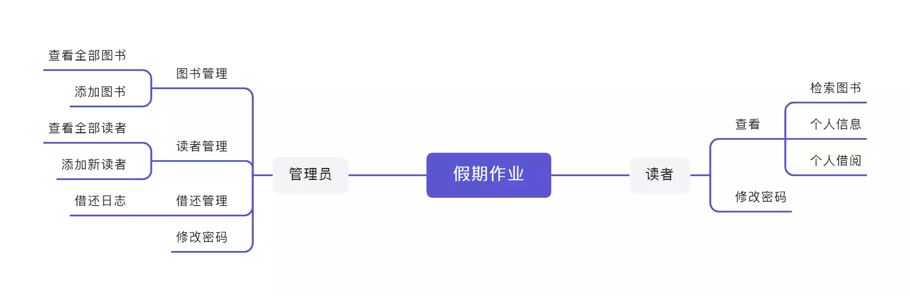

# 图书馆管理系统

> CVE待解决 @mysql connector 4x

### 假期更新图片

- 目前停留在Dev分支 还有一些MySQL的漏洞没解决掉

> MySQL CVE待解决

### 假期更新图片 II

- 分支合并完成 仍然还有一些MySQL的漏洞没解决掉

### 概述

- 基于 Spring + MyBatisPlus + Vue + Lombok 的图书馆管理系统，使用Maven进行包管理。主要功能包括：图书查询、图书管理、图书编辑、图书的借阅与归还以及借还日志记录等。

### 架构功能图片
  
### 环境配置
#### 开发环境：Windows 11 & Arch Linux
| 工具名称             | 用途                  |
| -------------------- | --------------------- |
| IntelliJ IDEA 2021.3 | Java 后端开发         |
| Web Storm 2021.3     | 前端开发              |
| VSCode               | 前端开发              |
| Docker               | SQL DataBase          |
| WSL Toolkit          | 调试用容器化Linux环境 |

#### 运行配置
 - Docker安装MySQL，设置用户名为 `root`，密码为 `123456`，并保证其在运行状态，并执行 `curtis_book.sql` 文件导入数据。

1. 使用浏览器访问 (提前配置好环境) [localhost](http://localhost:8080) 即可进入系统。

### 概念设计

用户分为两类：读者、图书馆管理员。图书馆管理员可以修改读者信息，修改书目信息，查看所有借还日志等；读者仅可以修改个人信息、借阅或归还书籍和查看自己的借还日志。

### TechStack
- Lombok 生成类
- Dao_MybatisPlus 数据层测试
- Service MybatisPlus 增量开发
- Controller Restful开发，使用ApiFox测试功能
- 页面
  - Vue
  - ElementUI 前后端分离 (可能没分离太开)
  - 异常抛报错
- 功能调整

### 功能报错问题
- SpringBoot可以正常跑 但是可能因为我修改了插件链接方式，导致SpringBoot报白板页。
- 项目完成95% 还差白板页没解决。

## License
